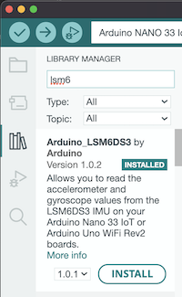
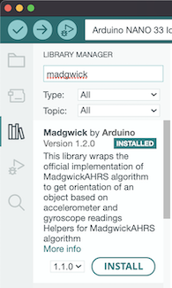
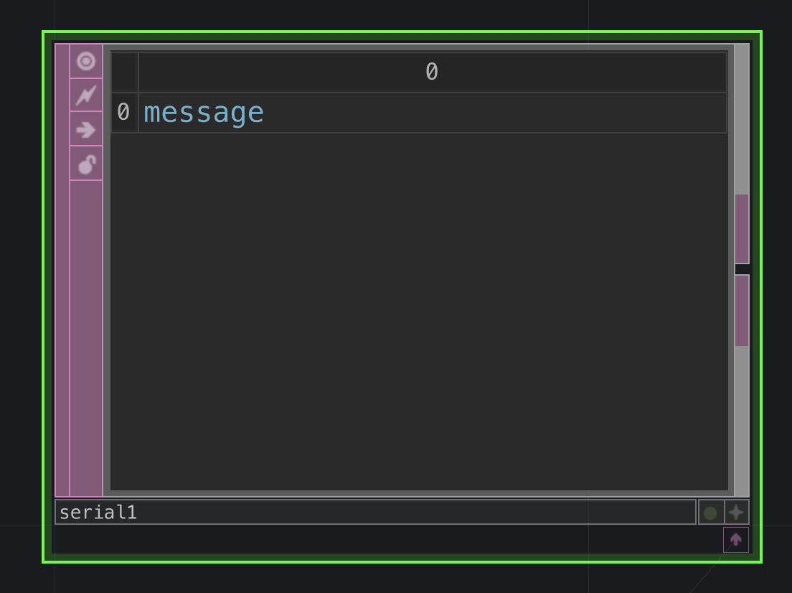
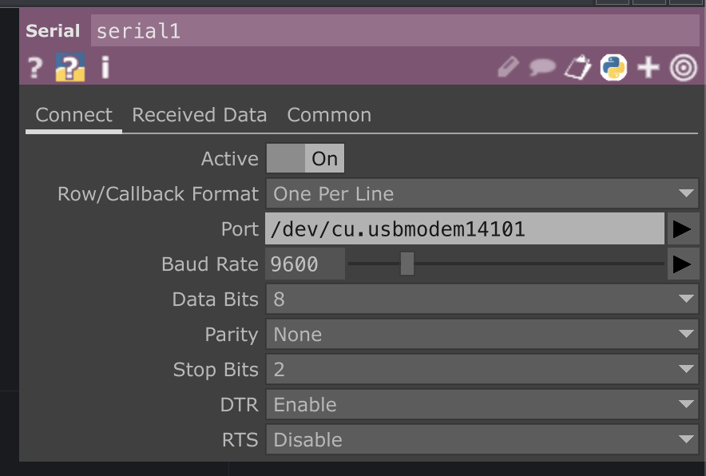
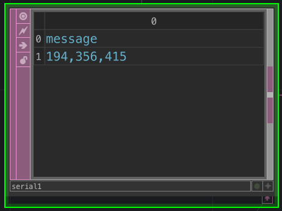
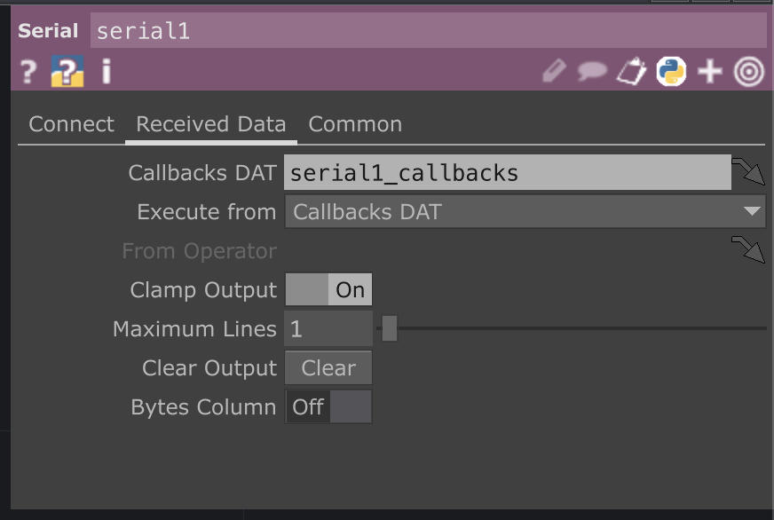

# Connecting Arduino and TouchDesigner Workshop 2022

## Description
Intro to TouchDesigner and Controlling outputs with arduino via serial communication with buttons, Analog sensors, and/or built-in IMU

This example shows the necessary python scripts, DATs, and CHOPs to set up Serial Communication with an Arduino. This example uses the the free version of TouchDesigner 2022 and the Arduino Nano 33 IoT.

Please come with you Arduino nano 33iot and kit. Please also have Touch Designer and Arduino installed on your machine
* [Touch Designer](https://itp.nyu.edu/physcomp/)
* [Arduino IDE](https://www.arduino.cc/en/software)

## Arduino Circuit:
This examples can be adjusted for any number of analog or digital inputs or the Nano 33 IoT's built in IMU. 


## Resources
* [ITP Physical Computing Site](https://itp.nyu.edu/physcomp/)
* [ITP Physical Computing IMU Serial Lab](https://itp.nyu.edu/physcomp/labs/lab-serial-imu-output-to-p5-js/)
* [IMA Designing Interfaces for Live Performance]()

## Further Resources
* [Interactive & Immersive HQ Youtube](https://www.youtube.com/c/TheInteractiveImmersiveHQ)
* [Elburz Sorkhabi and Matthew Ragan's Interactive & Immersive HQ](https://interactiveimmersive.io/)
* [Matthew Ragan's Teaching / Learnign Resources](https://matthewragan.com/teaching-resources/touchdesigner/)
* [Bileam Tschepe's youtube](https://www.youtube.com/channel/UCONptu0J1PCrW9YfBtSdqjA)
* [PPPANIK youtube](https://www.youtube.com/channel/UCWBbakpo_cATqJy9Dzf9x4w)
* [Paketa12 youtube](https://www.youtube.com/user/paketa12)
* [alltd.org](https://alltd.org/)

## Arduino Serial Communication
Read the available sensors and print out the values

    void setup() {
      pinMode(2, INPUT_PULLUP);
      //pinMode(2, INPUT); // Use input if you have 10k resistors
      Serial.begin(9600);
    }

    void loop() {
      int button = digitalRead(2);
      int sensor1 = analogRead(A0);
      int sensor2 = analogRead(A1);

      Serial.print(button);
      Serial.print(',');
      Serial.print(sensor1);
      Serial.print(',');
      Serial.println(sensor2);
    }

## Arduino IMU
If you are using the IMU, make sure you have installed the LSM6DS3 library and the MadgwickAHRS Library from the Library Manager




## Touch Designer
You can download the sample .toe file from this repo and also follow along with the serial set up below

Create a serial DAT, it will be turned off, and look like this until you enable it.


Next go to the parameters and begin entering your info:


My settings look like the image below:
* Row Callback Format: ```One Per Line```
* Port: ```COMx``` on Windows ```/dev/cu.usbmodemxxxx``` on Mac 


If all is set correctly, and arduino is printing information you should see some information in the Serial DAT


You may see multple lines of information.  You can go to the ```Received Data``` tab to change the output.  Change ```Maximum Lines``` to the amount of lines you want to show in your DAT.  1 line is enough for this tutorial.



Next we will parse out the information together in class and this repo will be updated afterward with more info from what we did in the session!
