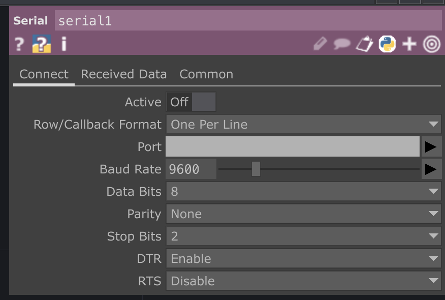

# Connecting Arduino and TouchDesigner Workshop 2022

* [Description](#description)
* [Arduino Circuit](#arduino-circuit)
* [Arduino Serial Setup with IMU](#arduino-serial-w-imu)
* [TouchDesigner](#touchdesigner)
* [Selecting and Exporting](#selecting-and-exporting)
* [Resources](#resources)
* [Further Resources](#further-resources)

## Description
Intro to TouchDesigner and Controlling outputs with arduino via serial communication with buttons, Analog sensors, and/or built-in IMU

This example shows the necessary python scripts, DATs, and CHOPs to set up Serial Communication with an Arduino. This example uses the the free version of TouchDesigner 2022 and the Arduino Nano 33 IoT.

Please come with you Arduino nano 33iot and kit. Please also have Touch Designer and Arduino installed on your machine
* [Touch Designer](https://itp.nyu.edu/physcomp/)

## Arduino Circuit:
This examples can be adjusted for any number of analog or digital inputs or the Nano 33 IoT's built in IMU. This example will use the IMU


## Arduino Serial w/ IMU
Make sure you have installed the LSM6DS3 library and the MadgwickAHRS Library from the Library Manager


Include the libraries:
    
    #include <Arduino_LSM6DS3.h>
    #include <MadgwickAHRS.h>

Add Global variables for the Madgwick Filter and the sensor sample rate. This example will only use the IMU's Gyroscope so create 3 variables to capture rotations on the x,y, and z axes of the Arduino.  I've called these variables twist, tilt, and turn.  If you want to try acceleration as well, create 3 more variables 


      Madgwick filter;
      // sensor's sample rate is fixed at 104 Hz:
      const float sensorRate = 104.00;

      // values for orientation:
      float twist = 0.0;
      float tilt = 0.0;
      float turn = 0.0;

In setup, check if the IMU is running.  If it is enabled, then begin filtering the values

      void setup() {
        Serial.begin(9600);
        // attempt to start the IMU:
          if (!IMU.begin()) {
            Serial.println("Failed to initialize IMU");
            // stop here if you can't access the IMU:
            while (true)
              ;
          }
        // start the filter to run at the sample rate:
        filter.begin(sensorRate);
      }
In the loop, check if the IMU is ready to read. If it is, grab the values and use ```Serial.print()``` to send the values to TouchDesigner.

      void loop() {
        // values for acceleration & rotation:
        float xAcc, yAcc, zAcc;
        float xGyro, yGyro, zGyro;

        // check if the IMU is ready to read:
        if (IMU.accelerationAvailable() && IMU.gyroscopeAvailable()) {
          // read accelerometer & gyrometer:
          IMU.readAcceleration(xAcc, yAcc, zAcc);
          IMU.readGyroscope(xGyro, yGyro, zGyro);

          // update the filter, which computes orientation:
          filter.updateIMU(xGyro, yGyro, zGyro, xAcc, yAcc, zAcc);

          // print the heading, pitch and roll
          twist = filter.getRoll();
          tilt = filter.getPitch();
          turn = filter.getYaw();
          Serial.print(twist);   // twist
          Serial.print(",");    
          Serial.print(tilt);    // tilt
          Serial.print(",");
          Serial.println(turn);  // turn
        }
      }

Note the formatting. We will use ```Serial.print()``` and ```Serial.println()``` to send multiple sensor values from the Arduino to Touchdesigner.  The goal is to format everything so that TouchDesigner will interpret all this Arduino as one message containing multiple values where the values are separated by commas.  

Use ```Serial.print()``` to send a value, the use ```Serial.print()``` again to send a _delimiter_. This delimiter should be a non alpha numerical character that will separate each individual value. I'm using commas to separate values.  In TouchDesigner I will eventually have to specify that commas are being used as delimiters (to separate my individual values).  Make sure the last value that you send uses the ```Serial.println()``` function.  This is how TouchDesigner will know that you intend to send a message that contains multiple values.

      Serial.print(twist);  // twist
      Serial.print(",");    
      Serial.print(tilt);   // tilt
      Serial.print(",");
      Serial.println(turn); // turn

Confirm that the sensors are working by opening the ```Serial Monitor``` and observing the values.  If the values are relatively consistent when the arduino is resting, and relatively smooth chaning when you move the arduino, then you are ready to move on.


## TouchDesigner
You can download the sample .toe file from this repo and also follow along with the serial set up below

Create a serial DAT, it will be turned off, and look like this until you enable it.


Next go to the parameters and begin entering your info:


My settings look like the image below:
* Row Callback Format: ```One Per Line```
* Port: ```COMx``` on Windows ```/dev/cu.usbmodemxxxx``` on Mac 


If all is set correctly, and arduino is printing information you should see some information in the Serial DAT


You may see multple lines of information.  You can go to the ```Received Data``` tab to change the output.  Change ```Maximum Lines``` to the amount of lines you want to show in your DAT.  1 line is enough for this tutorial.


Once the data is reliably displaying in the ```serial1``` DAT TouchDesigner use the ```convert``` DAT to breakout each value into its own separate column.

The default for ```Split Cells At``` parameter is a tab character: ```\t```


Change this parameter to a comma: ```,``` to see your data separated


Once the data is in separate individualized commas use a ```datTo1``` CHOP to convert incoming data into channel information.  Once it is in channel (CHOP) format, the sensor data can eventually be easily exported to other operators and parameters.

Use the follow settings for the ```datTo1``` CHOP:
* DAT: ```convert1```
* Select Rows: ```by Index```
* Start Row Index: ```1```
* Start Row Index: ```1``` (Should be default)
* Select Cols: ```by Index```
* Start Col Index: ```0```
* End Col Index: ```2``` (use your actual last column from the convert1 DAT)
* Output: ```Channel per Column```
* First Row is : ```Names ``` 
* First Column is : ```Values``` 

 

If everything is formatted correctly the output should look similar to the image below, with each sensor value being shown as a channel in the ```datTo1``` CHOP


Channels will be named based on the header from the ```convert``` DAT. Use a ```rename``` CHOP to change channel names.  In the ```From``` field you can use an asterisk ```*``` to select all channels in order.  Use the ```To``` field to define your desired channel names.  When renaming, separate each name with a space.


## Selecting and Exporting
Use a ```select``` CHOP to split channels into individual CHOPs.  This will make each channel individually routable.

Next connect to one of the premade examples. From here you should be able to see some changes and explore changing values to get different effects.


Try connecting sensors to some of the other examples in the provided .toe file.  The file examples are a hybrid of youtube tutorials (each linked in the file and below) and custom experiments.


## Resources
* [ITP Physical Computing Site](https://itp.nyu.edu/physcomp/)
* [ITP Physical Computing IMU Serial Lab](https://itp.nyu.edu/physcomp/labs/lab-serial-imu-output-to-p5-js/)
* [Elburz Sorkhabi (Interactive Immersive HQ) Particles and Metaballs](https://www.youtube.com/watch?v=FAYpBUBDonY)
* [Crystal Jow Holiday Point Clouds (Interactive Immersive HQ) ](https://www.youtube.com/watch?v=o0Hli7C1RME)
* [Cryystal Jow Generative Warhol Tutorial (Interactive Immersive HQ) ](https://www.youtube.com/watch?v=KmUUHRzG7UE)

## Further Resources
* [Interactive & Immersive HQ Youtube](https://www.youtube.com/c/TheInteractiveImmersiveHQ)
* [Matthew Ragan's Teaching / Learning Resources](https://matthewragan.com/teaching-resources/touchdesigner/)
* [Elburz Sorkhabi and Matthew Ragan's Interactive & Immersive HQ](https://interactiveimmersive.io/)
* [Bileam Tschepe's youtube](https://www.youtube.com/channel/UCONptu0J1PCrW9YfBtSdqjA)
* [PPPANIK youtube](https://www.youtube.com/channel/UCWBbakpo_cATqJy9Dzf9x4w)
* [Paketa12 youtube](https://www.youtube.com/user/paketa12)
* [alltd.org](https://alltd.org/)
